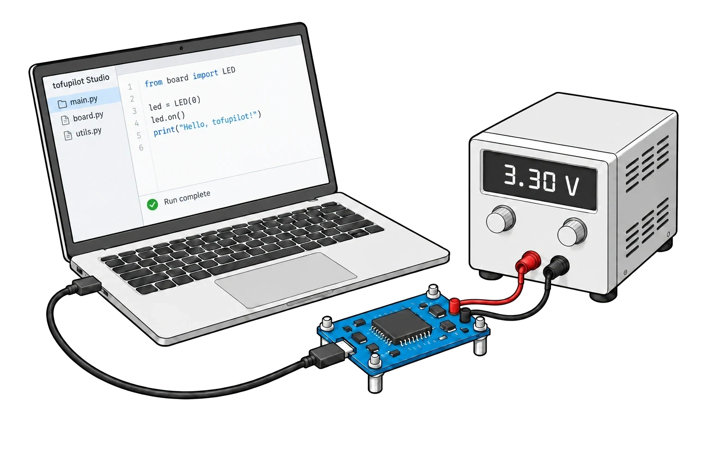
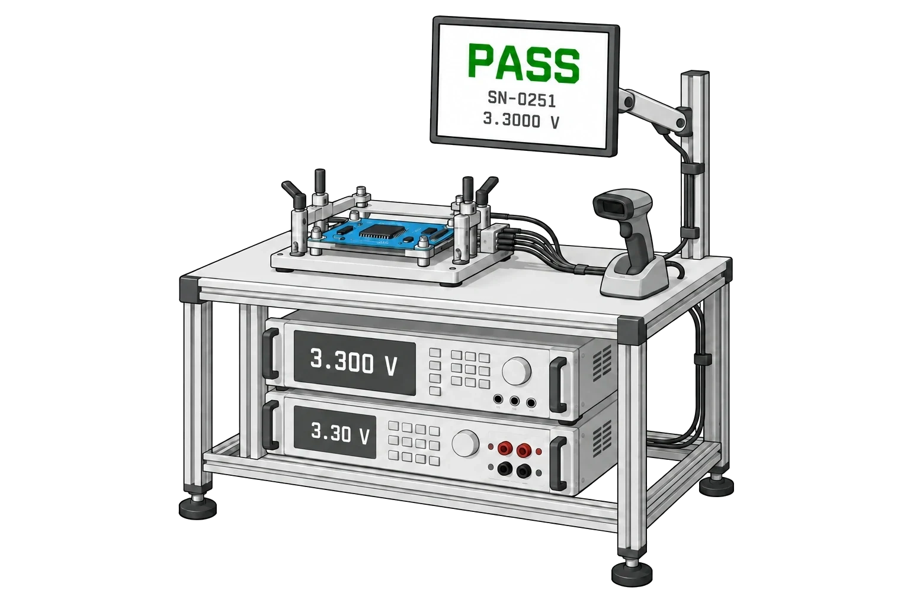

# tofupilot framework

An open-source test orchestration framework for hardware manufacturing. Write test logic in Python, define procedures in YAML, and run them locally or on production stations.

[Explore the framework](https://www.tofupilot.com/framework) · [Documentation](https://www.tofupilot.com/docs/frameworks/tofupilot) · [Templates](https://www.tofupilot.com/templates) · [Discord](https://discord.gg/fK3AeTyngh)

<a href="https://www.tofupilot.com/framework">
  
</a>

## Features

- **Phases:** Structure tests as Python functions with dependencies, retries, and cleanup.
- **Operator UI:** Declare prompts and controls in YAML to guide operators and collect inputs.
- **Parallel execution:** Run independent phases and fixture slots simultaneously.
- **Measurements:** Record values with units and limits for automatic pass/fail results.
- **Plugs:** Connect instruments and share resources through reusable Python classes.
- **Cross-platform:** Run on Windows, Linux, and macOS with the tofupilot CLI.
- **Connected results:** Run locally without an account, or connect to tofupilot for [unit traceability](https://www.tofupilot.com/traceability), [alerts](https://www.tofupilot.com/alerts), and [AI investigations](https://www.tofupilot.com/investigations).

## Get started

1. [Install the tofupilot CLI](https://www.tofupilot.com/docs/cli) for your operating system.
2. Clone the [framework starter](https://github.com/tofupilot/template-framework-starter) and run it locally:

   ```sh
   git clone https://github.com/tofupilot/template-framework-starter.git
   cd template-framework-starter
   tofupilot run
   ```

3. Edit `procedure.yaml` and the Python phases to build your own test.

Local execution does not require an account. To connect your results and deploy to a station, follow the [getting-started guide](https://www.tofupilot.com/docs/getting-started-with-tofupilot).

## Deploy to production

Connect your Git repository, deploy a procedure version to your stations, and give operators a local kiosk or browser interface. Completed runs queue locally when the connection drops and upload when it returns.

<a href="https://www.tofupilot.com/station">
  
</a>

[Explore deployment](https://www.tofupilot.com/station) · [Deployment documentation](https://www.tofupilot.com/docs/deployments)

## Templates

Browse the [template gallery](https://www.tofupilot.com/templates) for hardware test setups, procedures, and code, including [PCB functional testing](https://www.tofupilot.com/templates/functional-test-fixture-fct), [actuator dyno testing](https://www.tofupilot.com/templates/actuator-end-of-line-dyno-test), and [IMU thermal calibration](https://www.tofupilot.com/templates/imu-thermal-calibration).

For small examples of individual framework features, explore the templates in this repository:

| Example | What it covers |
| --- | --- |
| [Hello World](templates/1-hello-world) | Basic procedure structure |
| [Measurements](templates/2-measurements-basic) | Values, units, and pass/fail criteria |
| [Operator UI](templates/3-operator-ui-basic) | Operator inputs and displays |
| [Plugs](templates/4-plugs-basic) | Persistent instrument connections |
| [Attachments](templates/5-attachments-basic) | Files and data in test reports |
| [Parallel phases](templates/6-phases-parallel) | Independent phases running simultaneously |

## Documentation

Start with the [framework documentation](https://www.tofupilot.com/docs/frameworks/tofupilot), or jump to a specific topic:

- [Procedures](https://www.tofupilot.com/docs/frameworks/tofupilot/procedures)
- [Measurements](https://www.tofupilot.com/docs/frameworks/tofupilot/measurements)
- [Operator UI](https://www.tofupilot.com/docs/frameworks/tofupilot/operator-ui)
- [Plugs](https://www.tofupilot.com/docs/frameworks/tofupilot/plugs)
- [CLI reference](https://www.tofupilot.com/docs/cli)

See the [full documentation](https://www.tofupilot.com/docs) for station management, analytics, integrations, and hosting options.

## Community

<a href="https://discord.gg/fK3AeTyngh">
  
</a>

Join [Discord](https://discord.gg/fK3AeTyngh) to ask questions, share test setups, and talk with the team. Report bugs and request features through [GitHub issues](https://github.com/tofupilot/framework/issues).

## About

The tofupilot framework is maintained by [the tofupilot team](https://www.tofupilot.com/about), based in Lausanne, Switzerland. We build tools for the engineers and operators who test hardware.

## License

The framework is available under the [MIT license](LICENSE) for personal and commercial use. Connected dashboards, deployment management, and AI features are offered under [separate plans](https://www.tofupilot.com/pricing).

## Support the project

Help improve the framework with feedback, bug reports, feature requests, and contributions. Star this repository and share it with other hardware test engineers.

For shared production data, deployment management, and analytics, [explore tofupilot plans](https://www.tofupilot.com/pricing).
