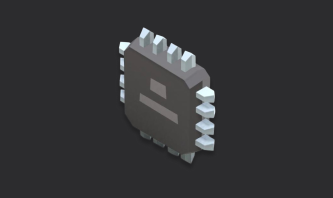

# Phases Parallel


Run independent test phases simultaneously.

## What You'll Learn

- Phases that depend on the same parent run in parallel
- Multiple measurements taken simultaneously
- Parallel execution without multiple slots

## When to Use This

Use parallel phases when you need to run independent tests simultaneously on a single unit, like measuring voltage, current, and temperature at the same time.

## Structure

```
phases-parallel/
├── procedure.yaml          # Defines parallel phase dependencies
├── phases/
│   ├── initialize.py       # Setup phase
│   ├── voltage_test.py     # Runs in parallel
│   ├── current_test.py     # Runs in parallel
│   └── temperature_test.py # Runs in parallel
└── README.md
```

## Key Concepts

- **Parallel Dependencies**: Phases with same `depends_on` run in parallel
- **Single Slot**: No slots configuration needed
- **Independent Tests**: Each test runs without waiting for others

## Execution Flow

```
Initialize
    ├─→ Voltage Test (parallel)
    ├─→ Current Test (parallel)
    └─→ Temperature Test (parallel)
```

## Next Steps

- [phases/dependencies](../../docs/framework/phases/dependencies) - Phase dependency patterns
- [measurements-basic](../measurements-basic) - Measurement basics
